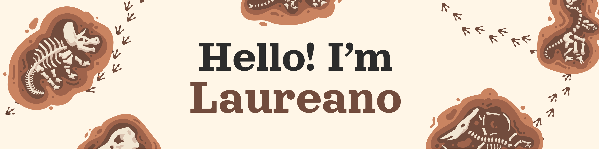

  

## About me 💡

I am Laureano Cuevas. I used to describe myself as a scientist, but that is actively changing at the moment.
That is because I am changing my career to the technological sector..

For that, I am studying at 42 Malaga, where we develop technical skills making complete projects and need to work on our soft skills to survive. This is a repository of those projects, where I try to organize them and make it more comprehensible to anyone looking. 

I have a varied and wide formation and experience in other matters that, In my humble opinion, can be recycled for programming and add extra perspectives and values to my capabilities.
Do not hesitate If you are interested in contacting me, can be here or refer to my email or my LinkedIn 

  <h3>Skills I'm Working On </h3>
  

## Projects

- 📚 [42 Common Core](https://github.com/100tfko/42-Common-Core)
- 🌐 [42 Outer Core](https://github.com/100tfko/42-Outer-Core)
- 🚀 Personal Projects
- 🧪 Developing Ideas

## 42 Profile

